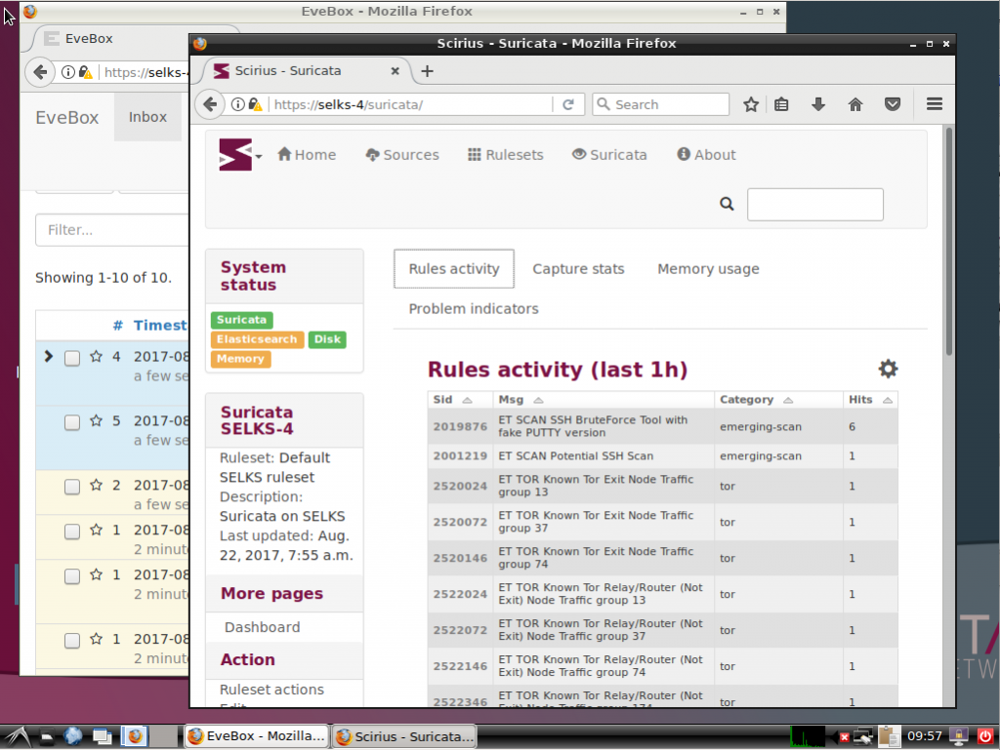
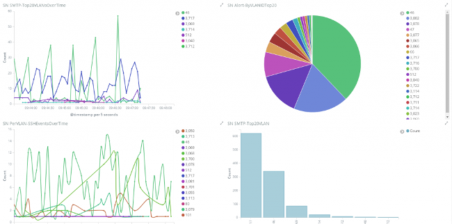

=====
SELKS
=====

Intro
=====

SELKS is a free and open source Debian (with LXDE X-window manager) based IDS/IPS platform 
released under GPLv3 from Stamus Networks (https://www.stamus-networks.com/).

The SELKS ISO is both Live and Installable ISO in one. Once installed it is 
ready to use out of the box solution.

SELKS is comprised of the following major components:

* S - Suricata IDPS - http://suricata-ids.org/
* E - Elasticsearch - https://www.elastic.co/products/elasticsearch
* L - Logstash - https://www.elastic.co/products/kibana
* K - Kibana - https://www.elastic.co/products/logstash
* S - Scirius - https://github.com/StamusNetworks/scirius
* EveBox - https://evebox.org/

Getting SELKS
=============

You can download ready to use images from the `SELKS download page <https://www.stamus-networks.com/open-source/#selks>`_.

    

    

Howto run SELKS
===============

Prerequisites
-------------

Recommended initial test set up for SELKS is 2 CPUs 5 Gb RAM

The minimal configuration for production usage is 2 cores and 6 Gb of memory. As Suricata
and Elastisearch are multithreaded, the more cores you have the better it is.
Regarding memory, the more traffic to monitor you have, the more getting some extra memory will be interesting.
See `Running SELKS in production <https://github.com/StamusNetworks/SELKS/wiki/Running-SELKS-in-production>`_ page
for more info.

Running on a virtual machine
----------------------------

You need to create or reuse a virtual machine.

For VirtualBox, the recommended network setup is to use a ``Bridged adapter`` and to allow
``Promiscuous mode`` on the interface. This way, SELKS will be able to analyse the traffic from the physical host.

To run SELKS, you need to add declare that the ISO image of SELKS is in the CDROM. You can then
reboot the virtual machine. If all goes well, you should see SELKS boot menu. Pressing enter will
lead you to the graphical interface.

Running on a physical box
-------------------------

To run SELKS, you need to burn the ISO image of SELKS on a DVD. After inserting
the DVD into the host drive, you can reboot.

If all goes well, you should see SELKS boot menu. Pressing enter will
lead you to the graphical interface.

Usage and logon credentials
===========================

Default OS user:

* user: ``selks-user``
* password: ``selks-user`` (password in Live mode is ``live``)

The default root password is ``StamusNetworks``

You need to authenticate to access to the web interface(see the ``HTTPS access`` section below ). The default user/password is ``selks-user/selks-user`` (including through the Dashboards or Scirius desktop icons).
You can change credentials and user settings by using the top left menu in Scirius.  
More info about the user roles and set up - https://github.com/StamusNetworks/scirius#usage

SELKS has 13 default IDS dashboards -  

* SN ALL
* SN ALERTS
* SN DNS
* SN FILE-Transactions
* SN FLOW
* SN HTTP
* SN IDS
* SN OVERVIEW
* SN SMTP
* SN SSH
* SN STATS
* SN TLS
* SN VLAN

in addition to the ``Events viewer`` (EveBox)

A link to the Kibana dashboards can also be found by clicking on the Stamus Icon on top left of
Scirius, the rule management interface.

Elasticsearch, Logstash and Suricata are build in and can be used as standard services, ex ::

 systemctl restart suricata
 systemctl stop logstash 

Suricata ruleset is updated and Suricata is restarted every days at 2:00AM.

Building SELKS
==============

If you would like to build an installable SELKS ISO from scratch and add extra packages of your choice to it - 
extended information on how to build SELKS ISO can be found on
`Building SELKS wiki page <https://github.com/StamusNetworks/SELKS/wiki/Building-SELKS>`_.

Tuning SELKS
==============
You can find information about tuning and other considerations on
`SELKS wiki page <https://github.com/StamusNetworks/SELKS/wiki/>`_.

HTTPS access
============

Scirius and EveBox have desktop icons and could be used 
directly with just a double click once logged in the SELKS desktop.

If you wish to remotely (from a different PC on your network) access the 
dashboards you could do that as follows (in your browser):

* https://your.selks.IP.here/ - Scirius ruleset management and a central point for all dashboards and EveBox

You need to authenticate to access to the web interface. The default user/password is the
same as for local access: ``selks-user/selks-user``. Don't forget to change credentials at first
login. You can do that by going to ``Account settings`` in the top left dropdown menu of
Scirius.

Note
----

Remote access to the web interfaces is currently only httpS protected. It can be 
further protected with firewall rules and/or authentication or simply by using 
"service nginx start/stop"

Firewall rules
--------------
 
By default there are no firewall rules implemented.

SSH
----

SSH is enabled and the ``selks-user`` can ssh to the box by default.

Desktop manager
===============

SELKS uses LXDE as a desktop windows manager. If you have installed the 
desktop version and wish to to uninstall the Desktop Manager (GUI) 
and run the server/machine just with command shell - you can remove the 
desktop installation as follows after the installation: ::

 apt-get remove lxde lxde-common lxde-core lxde-icon-theme lightdm \
                hunspell-en-us hyphen-en-us iceweasel lxlauncher lxtask

This will not affect the services and/or scripts. SELKS would still continue 
to operate and function as desired. 

If you wish you can also directly download and use the SELKS no desktop 
edition from the download page.

Getting help
============

You can get more information on SELKS wiki: https://github.com/StamusNetworks/SELKS/wiki

You can get help about SELKS on Freenode IRC on the #SELKS channel or use our mailing list: http://groups.google.com/d/forum/selks

If you encounter a problem, you can open a ticket on https://github.com/StamusNetworks/SELKS/issues
