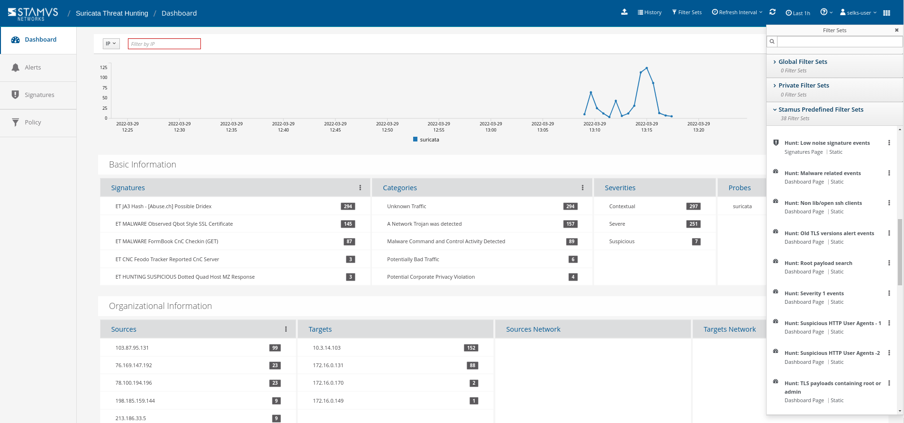
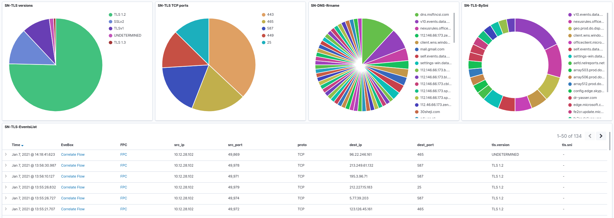
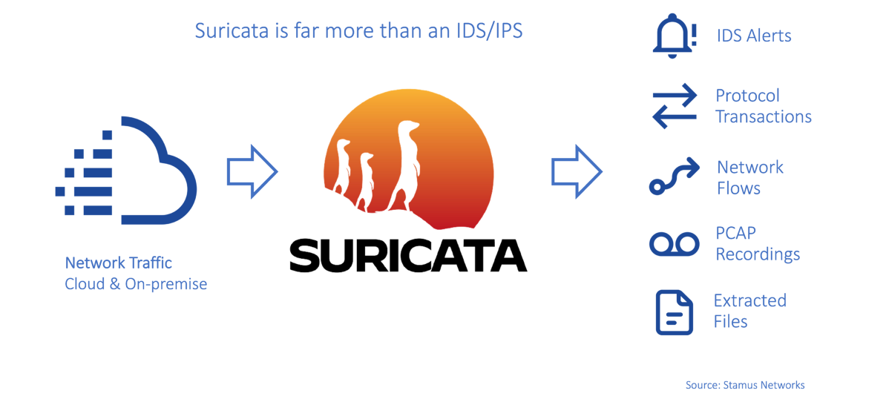
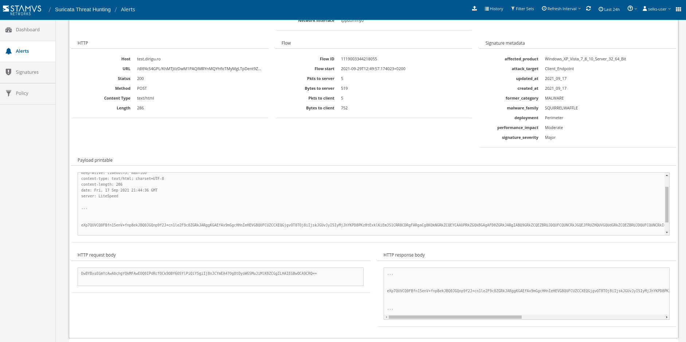
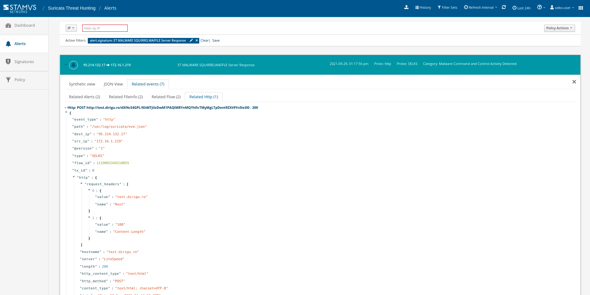

| ℹ This README concerns the standard debian-based SELKS distribution. For instructions concerning the new implementation on Docker, please see `SELKS on docker <docker/README.md>`_ 

=====
SELKS
=====

Intro
=====

SELKS is a free and open source Debian-based IDS/IPS/Network Security Monitoring platform 
released under GPLv3 from Stamus Networks (https://www.stamus-networks.com/). 

The SELKS ISO is both Live and Installable ISO in one. SELKS can also be installed via docker compose on any Linux OS. Once installed it is 
ready to use out of the box solution.

SELKS is comprised of the following major components:

* S - Suricata IDPS/NSM - https://suricata.io/
* E - Elasticsearch - https://www.elastic.co/products/elasticsearch
* L - Logstash - https://www.elastic.co/products/logstash
* K - Kibana - https://www.elastic.co/products/kibana
* S - Scirius - https://github.com/StamusNetworks/scirius
* EveBox - https://evebox.org/
* Arkime - https://arkime.com/
* CyberChef - https://github.com/gchq/CyberChef

The acronym was established before the addition of Arkime, EveBox and CyberChef.  

And it includes preconfigured dashboards like this one:

What is SELKS
=============

Suricata
--------

SELKS is a showcase of what Suricata IDS/IPS/NSM can do and the network protocol monitoring logs and alerts it produces. As such any and all data in SELKS is generated by Suricata: 

Threat Hunting
--------------

This is further enhanced by open source Scirius - Stamus' developed and threat hunting interface specifically enhanced for Suricata. It includes predefined hunting filters and enhanced contextual views:

Logs
----

An example subset (not complete) of raw JSON logs generated by Suricata `can be found here <https://github.com/StamusNetworks/SELKS/tree/master/doc/example-logs>`_ 

Information
-----------

If you are a new to Suricata, you can read a series of articles we wrote about `The other side of Suricata <https://www.stamus-networks.com/blog/the-other-side-of-suricata>`_.

Dashboards
----------

SELKS has by default over 28 default dashboards, more than 400 visualizations and 24 predefined searches available.

Here is an extract of the dashboards list: SN-ALERTS, SN-ALL, SN-ANOMALY, SN-DHCP, SN-DNS, SN-DNP3, SN-FILE-Transactions, SN-FLOW, SN-HTTP, SN-HUNT-1, SN-IDS, SN-IKEv2, SN-KRB5, SN-MQTT, SN-NFS, SN-OVERVIEW, SN-RDP, SN-RFB, SN-SANS-MTA-Training, SN-SIP, SN-SMB, SN-SMTP, SN-SNMP, SN-SSH, SN-STATS, SN-TLS, SN-VLAN, SN-TFTP, SN-TrafficID

Additional visualizations and dashboards are also available in the ``Events viewer`` (EveBox).

A link to the Kibana dashboards can also be found by clicking on the switcher app on the top right of corner of
Scirius, the ruleset and hunting management interface.

Getting SELKS
=============

ISO
---

You can download ready to use images from the `SELKS download page <https://www.stamus-networks.com/selks>`_.         
You can find here the `first time setup guide <https://github.com/StamusNetworks/SELKS/wiki/First-time-setup>`_.

Docker
------

You can spin up SELKS on any Linux OS in minutes via docker compose - `please read more here <https://github.com/StamusNetworks/SELKS/blob/master/docker/README.md>`_.
    
How to run SELKS
===============

Prerequisites
-------------

The minimal configuration for production usage is 2 cores and 9 Gb of memory. As Suricata
and Elastisearch are multithreaded, the more cores you have the better it is.
Regarding memory, the more traffic to monitor you have, the more getting some extra memory will be interesting.
See `Running SELKS in production <https://github.com/StamusNetworks/SELKS/wiki/Running-SELKS-in-production>`_ page
for more info.

Running on a virtual machine
----------------------------

You need to create or reuse a virtual machine.

For VirtualBox, the recommended network setup is to use a ``Bridged adapter`` and to allow
``Promiscuous mode`` on the interface. This way, SELKS will be able to analyse the traffic from the physical host.

To run SELKS, you need to add declare that the ISO image of SELKS is in the CDROM. You can then
reboot the virtual machine. If all goes well, you should see SELKS boot menu. Pressing enter will
lead you to the graphical interface.

Running on a physical box
-------------------------

To run SELKS, you need to burn the ISO image of SELKS on a DVD. After inserting
the DVD into the host drive, you can reboot.

If all goes well, you should see SELKS boot menu. Pressing enter will
lead you to the graphical interface.

Usage and logon credentials
===========================

Default OS user:

* user: ``selks-user``
* password: ``selks-user`` (password in Live mode is ``live``)

The default root password is ``StamusNetworks``

You need to authenticate to access to the web interface(see the ``HTTPS access`` section below ). The default user/password is ``selks-user/selks-user`` (including through the Dashboards or Scirius desktop icons).
You can change credentials and user settings by using the top left menu in Scirius.  
More info about the user roles and set up - https://github.com/StamusNetworks/scirius#usage

Elasticsearch, Logstash and Suricata are build in and can be used as standard services, ex ::

 systemctl restart suricata
 systemctl stop logstash 

To restart Scirius: ::

 /usr/bin/supervisorctl restart scirius

Suricata ruleset is updated and Suricata is restarted every days at 2:00AM.

Building or customizing SELKS
=============================

If you would like to build an installable SELKS ISO from scratch and add extra packages of your choice to it - 
extended information on how to build and customize SELKS ISO can be found on  

* `Building SELKS wiki page <https://github.com/StamusNetworks/SELKS/wiki/Building-SELKS>`_
* `Customizing SELKS wiki page <https://github.com/StamusNetworks/SELKS/wiki/Customizing-SELKS>`_

Tuning SELKS
==============
You can find information about tuning and other considerations on
`SELKS wiki page <https://github.com/StamusNetworks/SELKS/wiki/>`_.

HTTPS access
============

Scirius and EveBox have desktop icons and could be used 
directly with just a double click once logged in the SELKS desktop.

If you wish to remotely (from a different PC on your network) access the 
dashboards you could do that as follows (in your browser):

* https://your.selks.IP.here/ - Scirius ruleset management and a central point for all dashboards and EveBox

You need to authenticate to access to the web interface. The default user/password is the
same as for local access: ``selks-user/selks-user``. Don't forget to change credentials at first
login. You can do that by going to ``Account settings`` in the top left dropdown menu of
Scirius.

Note
----

Remote access to the web interfaces is currently only httpS protected. It can be 
further protected with firewall rules and/or authentication or simply by using 
``/bin/systemctl start/stop nginx``

Firewall rules
--------------
 
By default there are no firewall rules implemented.

SSH
----

SSH is enabled and the ``selks-user`` can ssh to the box by default.

Getting help
============

You can get more information on SELKS wiki: https://github.com/StamusNetworks/SELKS/wiki

You can get help about SELKS on in our mailing list: http://groups.google.com/d/forum/selks or feel free to drop in for a live discussion in our Discord channel https://discord.gg/h5mEdCewvn

If you encounter a problem, you can open a ticket on https://github.com/StamusNetworks/SELKS/issues

Enterprise scale Deployments
============================

While SELKS is suitable as a production network security solution in small to medium sized organizations and is a great system to test out the power of Suricata for intrusion detection and threat hunting, it was never designed to be deployed in an enterprise setting. For enterprise applications, please review our commercial solution, Stamus Security Platform (SSP).

Stamus Security Platform (Commercial Solution)
==============================================
Stamus Security Platform (SSP) is the commercial network-based threat detection and response solution from Stamus Networks. While it retains much of the same look and feel as SELKS, SSP is a completely different system and requires a new software installation.

Available in two license tiers, SSP delivers:

Broad-Spectrum Threat Detection
-------------------------------
* Multiple detection mechanisms from machine learning, anomaly detection, and signatures
* High-fidelity “Declarations of Compromise” with multi-stage attack timeline
* Weekly threat intelligence updates from Stamus Labs

Guided Threat Hunting and Incident Investigation
------------------------------------------------
* Advanced guided threat hunting filters
* Host insights tracks over 60 security-related attributes
* Easily convert hunt results into custom detection logic
* Explainable and transparent results with evidence

Enterprise Scale Management and Integration
-------------------------------------------
* Automated classification and alert triage
* Management of multiple probes from single console
* Seamless integration with SOAR, SEIM, XDR, EDR, IR
* Multi-tenant operation
* Configuration backup and restoration 

More Information about SSP
==========================

Visit `this page to request a demo of SSP <https://www.stamus-networks.com/demo>`_

To learn more about the differences between SELKS and our commercial solutions, please read through "*Understanding SELKS and Stamus Commercial Platforms*" `Download the white paper here. <https://www.stamus-networks.com/hubfs/Library/Documents%20(PDFs)/StamusNetworks-WP-SELKS-SSP-092021-1.pdf>`_

